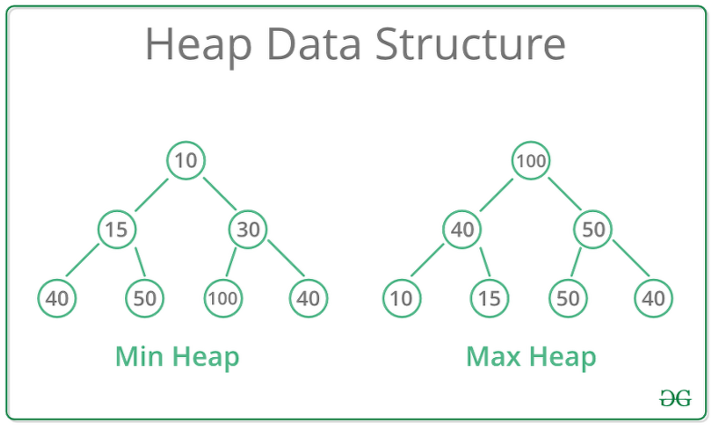

## 목차
1. 트리
2. 힙
3. 그래프
4. DFS & BFS
5. Dynamic Programming

<hr>

## 1. 트리

## 2. 힙
힙이란?
* 힙은 데이터에서 최대값과 최소값을 빠르게 찾기 위해 고안된 완전 이진 트리(Complete Binary Tree)
* 힙은 항상 큰 값이 상위 레벨에 있고 작은 값이 하위 레벨에 있도록 하는 자료구조
```
      8      Level 0
    6   3    Level 1
     2 1     Level 2  # -> 이진 트리 O 완전 이진 트리 X 이므로 힙이 아닙니다!

      8      Level 0
    6   3    Level 1  # -> 이진 트리 O 완전 이진 트리 O 인데 모든 부모 노드의 값이
   4 2 1     Level 2  # 자식 노드보다 크니까 힙이 맞습니다!


      8      Level 0
    6   3    Level 1  # -> 이진 트리 O 완전 이진 트리 O 인데 모든 부모 노드의 값이
   4 2 5     Level 2  # 자식 노드보다 크지 않아서 힙이 아닙니다..!
```
* 힙은 최대값을 맨 위로 올릴 수도 있고, 최솟값을 맨 위로 올릴 수 도 있음.
    * 최댓값이 맨 위인 힙을 Max 힙
    * 최솟값이 맨 위인 힙을 Min 힙

<br>
<br>

#### 힙의 규칙
```힙은 항상 큰 값이 상위 레벨에 있고 작은 값이 하위 레벨에 있어야 한다```
* 원소를 추가하거나 삭제할 때도 규칙이 지켜져야함
* 원소를 추가하는 방법!
  1. 원소를 맨 마지막에 넣는다.
  2. 부모노드와 비교하여 더크다면 자리를 바꾼다.
  3. 부모 노드보다 작거나 가장 위에 도달하지 않을 때까지 2번 과정을 반복한다.
```
이 맥스 힙에서 9를 추가해보겠습니다!
      8      Level 0
    6   3    Level 1  
   4 2 1     Level 2 

1. 맨 마지막에 원소를 넣습니다.

      8      Level 0
    6   3    Level 1  
   4 2 1 9   Level 2 

2-1. 부모 노드와 비교합니다. 3보다 9가 더 크니까! 둘의 자리를 변경합니다.

      8      Level 0
    6   3    Level 1  
   4 2 1 9   Level 2 

      8      Level 0
    6   9    Level 1  
   4 2 1 3   Level 2 

2-2. 다시 부모 노드와 비교합니다. 8보다 9가 더 크니까! 둘의 자리를 변경합니다.

      8      Level 0
    6   9    Level 1  
   4 2 1 3   Level 2 

      9      Level 0
    6   8    Level 1  
   4 2 1 3   Level 2 

3. 가장 위에 도달했으므로 멈춥니다. 힙의 특성을 그대로 유지해 데이터를 삽입했습니다!

      9      Level 0
    6   8    Level 1  
   4 2 1 3   Level 2
```